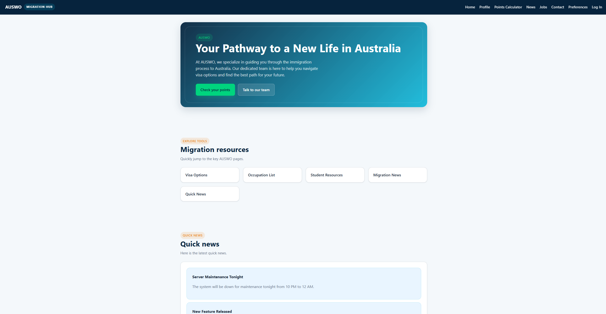

# AUSWO
**IT Industry Project for AUSWO**



## Running with Docker

### To start the server:
1. Open a terminal in the project directory.
2. Build and start the container:
   ```bash
   docker compose up --build
   ```

3. The website can be viewed at [http://localhost:3000](http://localhost:3000).

The MySQL database listens on port `3306` with database `AUSWO` and password `AUSWO2025`.

### To stop the server:

1. Stop the container (data will **persist**):

   ```bash
   docker compose down
   ```
**OR**

2. Stop the container and remove volumes (data will be **deleted**):

   ```bash
   docker compose down -v
   ```
   
