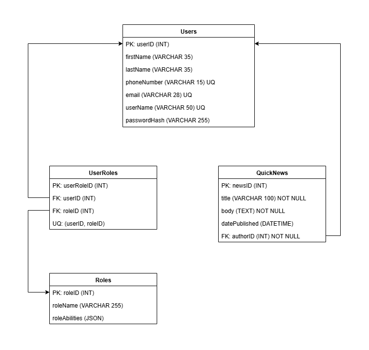

# AUSWO
IT Industry Project for AUSWO



## Running with Docker

1. Build and start the containers:
   ```bash
   docker compose up --build
   ```
2. The website can be viewed at [http://localhost:3000](http://localhost:3000).
3. The MySQL database listens on port `3306` with database `AUSWO` and password `test`.


Add npm install for each dependency found in the package.json file